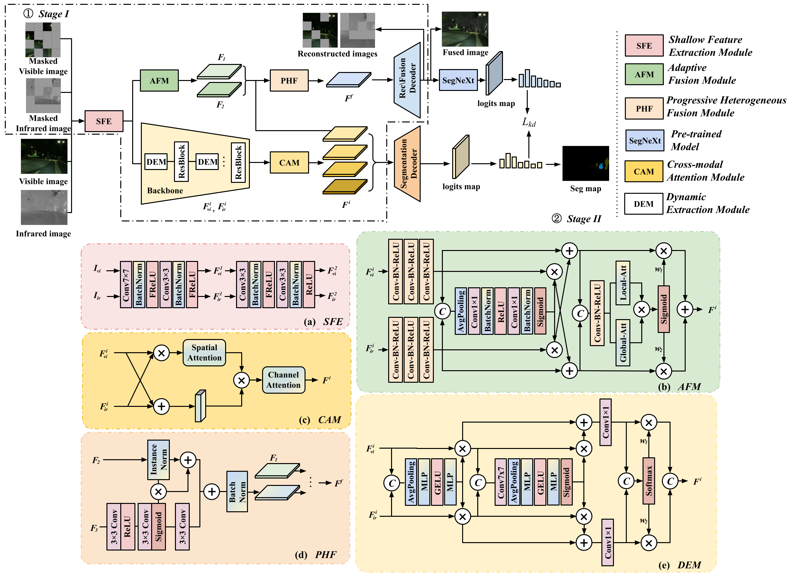

# MAFS: Masked Autoencoder for Infrared-Visible Image Fusion and Semantic Segmentation
[Liying Wang](https://blog.csdn.net/weixin_46202235), [Xiaoli Zhang<sup>*</sup>](https://zhangxiaolijlu.github.io/),  [Chuanmin Jia<sup>*</sup>](https://github.com/Codersadis), and [Siwei Ma](https://idm.pku.edu.cn/en/info/1009/1017.htm)

-[*[ArXiv]*](https://www.arxiv.org/abs/2509.11817)

## 🌟 Update
- [2024/12] The manuscript has been submitted to IEEE Transactions on Image Processing.
- [2025/9] We have received the acceptance notification😊

## 📚 Abstract
Infrared-visible image fusion methods aim at generating fused images with good visual quality and also facilitate the performance of high-level tasks. Indeed, existing semantic-driven methods have considered semantic information injection for downstream applications. However, none of them investigates the potential for reciprocal promotion between pixel-wise image fusion and cross-modal feature fusion perception tasks from a macroscopic task-level perspective. To address this limitation, we propose a unified network for image fusion and semantic segmentation. MAFS is a parallel structure, containing a fusion sub-network and a segmentation sub-network. On the one hand, we devise a heterogeneous feature fusion strategy to enhance semantic-aware capabilities for image fusion. On the other hand, by cascading the fusion sub-network and a segmentation backbone, segmentation-related knowledge is transferred to promote feature-level fusion-based segmentation. Within the framework, we design a novel multi-stage Transformer decoder to aggregate
fine-grained multi-scale fused features efficiently. Additionally, a dynamic factor based on the max-min fairness allocation principle is introduced to generate adaptive weights of two tasks and guarantee smooth training in a multi-task manner.
<div align="center">
  
</div>

### 🌻Test
Test and training parts will be open soon.

### 🚀 Training
**1. Virtual Environment**
```
# create virtual environment
conda create -n MAFS python=3.8.0
conda activate MAFS
# select the pytorch-gpu version yourself
# install MAFS requirements
pip install -r requirements.txt
```
Please note: the provided `requirements.txt` was generated from our environment and may depend on specific hardware/software settings. Ensure compatibility with your own machine before installation😊

**2. Training Dataset**

The Training and test datasets are strictly consistent with the original dataset split. For more details, see the relevant repositories: [MFNet](https://www.mi.t.u-tokyo.ac.jp/static/projects/mil_multispectral/), [PST900](https://github.com/ShreyasSkandanS/pst900_thermal_rgb), and [FMB](https://github.com/JinyuanLiu-CV/SegMiF).
Besides, MAFS's checkpoints can be downloaded from this [link](https://pan.baidu.com/s/1EaLbqHdbWI7-sFJYFKXRFQ?pwd=mafs). Code: mafs.

## 📝 Citation


## 😊 Any question

If you have any corresponding questions, please feel free to contact [Liying Wang](https://blog.csdn.net/weixin_46202235) at `my_lnnu@163.com` or `liyingw23@gmails.jlu.edu.cn`.


## 💡Acknowledgements
Our code is built based on [PSFusion](https://github.com/Linfeng-Tang/PSFusion) and [DeFusion](https://github.com/erfect2020/DecompositionForFusion). [SegMiF](https://github.com/JinyuanLiu-CV/SegMiF) and [CDDFuse](https://github.com/Zhaozixiang1228/MMIF-CDDFuse) primarily inspire this work. Please also follow their licenses. If you are inspired by [MRFS](https://github.com/HaoZhang1018/MRFS), please also cite their paper. We sincerely thank Dr. [Xihang Hu's](https://github.com/hu-xh) valuable suggestion during the experimental implementation. If you're interested in the field of salient object detection or camouflaged object detection, please refer to [hu-xh](https://github.com/hu-xh). Thank you all for your attention.

